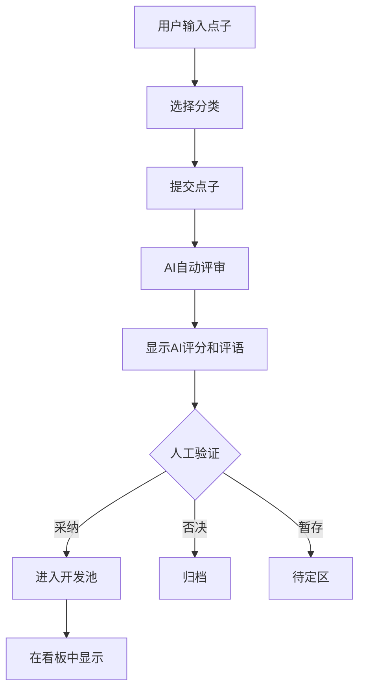

# 第一阶段：需求收集页面 - 需求文档

## 1. 页面概述
**需求收集页面**是"01计划"的起点，用户在这里记录所有创意点子，并经过AI初步评审和人工验证，形成有序的需求池。

## 2. 核心功能

### 2.1 点子录入
- **快速输入**：一个醒目的输入框，支持文字、图片、链接
- **分类标签**：点子创建时选择主分类（App/网页/小程序/Agent/工具库/内容产品/硬件产品/其他）
- **自定义标签**：支持添加多个自定义标签（如"AI驱动"、"社交"、"工具"、"娱乐"等）
- **优先级标记**：紧急度、重要性（可后续调整）

### 2.2 AI初步评审
- **自动触发**：点子提交后自动调用AI评审
- **评审维度**（按权重排序）：
  - **用户价值** (1-10分)：解决什么问题？多少人需要？**权重最高**
  - **可行性** (1-10分)：技术实现难度、资源需求 **权重次高**
  - **商业价值** (1-10分)：盈利潜力、市场规模 **权重中等**
  - **趣味性** (1-10分)：是否有趣、有创意？ **权重最低**
- **评审总结**：AI生成一段简要评语和建议

### 2.3 人工二次验证
- **评审界面**：清晰展示AI评分和评语
- **人工调整**：可修改评分、补充意见
- **最终决策**：
  - ✅ 采纳进入开发池
  - ❌ 否决归档
  - ⏸️ 暂存待定

### 2.4 需求池管理
- **看板视图**：按分类、评分、状态筛选
- **搜索功能**：关键词搜索点子内容
- **排序方式**：按评分、创建时间、优先级排序
- **批量操作**：批量删除、归档、导出

## 3. 页面布局设计

```
┌─────────────────────────────────────────────────────────┐
│  头部: "01计划 - 需求收集"                               │
├─────────────────────────────────────────────────────────┤
│  [快速输入框] [分类选择] [提交按钮]                       │
├─────────────────────────────────────────────────────────┤
│  筛选区: [全部/App/网页/...] [评分过滤] [搜索框]          │
├─────────────────────────────────────────────────────────┤
│  点子卡片列表（瀑布流或网格）                             │
│  ┌────────────┐ ┌────────────┐                         │
│  │ 点子标题    │ │ 点子标题    │                         │
│  │ 分类标签    │ │ 分类标签    │                         │
│  │ AI评分      │ │ AI评分      │                         │
│  │ 评语摘要    │ │ 评语摘要    │                         │
│  │ [查看详情]  │ │ [查看详情]  │                         │
│  └────────────┘ └────────────┘                         │
│                                                         │
└─────────────────────────────────────────────────────────┘
```

## 4. 交互流程



## 5. 技术要点

### 5.1 AI集成
- **模型选择**：DeepSeek API（性价比高，中文优化好）
- **提示词设计**：结构化输出评分和评语
- **成本控制**：缓存结果、批量处理

### 5.2 数据存储
- **存储方案**：纯前端存储（IndexedDB），无需后端，单机使用
- **数据结构**：
  ```json
  {
    "id": "uuid",
    "title": "点子标题",
    "description": "详细描述",
    "category": "app/web/mini/agent/toolkit/content/hardware/other",
    "tags": ["AI驱动", "社交", "工具"],
    "ai_score": {
      "user_value": {"score": 8, "weight": 0.4},
      "feasibility": {"score": 7, "weight": 0.3},
      "business_value": {"score": 5, "weight": 0.2},
      "fun": {"score": 6, "weight": 0.1}
    },
    "ai_comment": "AI评语",
    "human_review": {"status": "accepted/rejected/pending", "notes": "人工备注"},
    "created_at": "2026-06-11T22:24:00Z",
    "updated_at": "2026-06-11T22:24:00Z"
  }
  ```

### 5.3 前端技术
- **框架选择**：React（推荐）或 Vue
- **UI组件库**：Ant Design / MUI / Chakra UI
- **状态管理**：Zustand / Redux Toolkit

## 6. 已确认的决策

### ✅ 分类体系
- **主分类**：App需求 / 网页需求 / 小程序需求 / Agent / 工具库 / 内容产品 / 硬件产品 / 其他
- **自定义标签**：支持添加多个自定义标签（取代固定分类扩展）
- **移除Skill分类**：其功能可由"工具库"或"Agent"覆盖

### ✅ AI模型选择
- **DeepSeek API**：性价比高，中文优化好

### ✅ 数据存储
- **纯前端存储**：使用IndexedDB，无需后端，单机使用

### ✅ 用户身份
- **单用户模式**：无需登录，适合个人使用

### ✅ 评审维度权重
- **用户价值** > **可行性** > **商业价值** > **趣味性**

## 7. 待确认细节

1. **分类体系建议**：上述分类是否合适？需要进一步调整吗？
2. **自定义标签的实现**：标签是自由输入还是从预设中选择？
3. **AI评分算法**：加权总分计算公式需要确认吗？
4. **数据导出/导入**：是否需要支持数据备份功能？

## 8. 下一步

### 第一阶段开发计划（由CodeBuddy执行）
1. **创建项目技术栈**：React + Vite + TypeScript
2. **搭建基础框架**：页面布局、组件结构
3. **实现点子录入和显示**：输入表单、列表展示
4. **集成AI评审**：DeepSeek API调用、评分展示
5. **完善人工验证流程**：采纳/否决/暂存功能

### 第二阶段准备
- 开始规划**需求开发页面**的项目管理功能
- 设计任务拆分、进度跟踪、团队协作等模块

---
*文档版本：v0.2 - 2026-06-11*
*更新记录：根据用户决策更新分类、AI模型、数据存储、用户身份、权重设置*